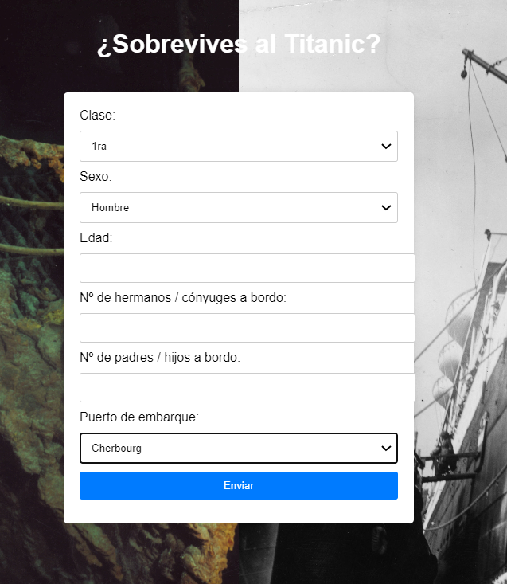
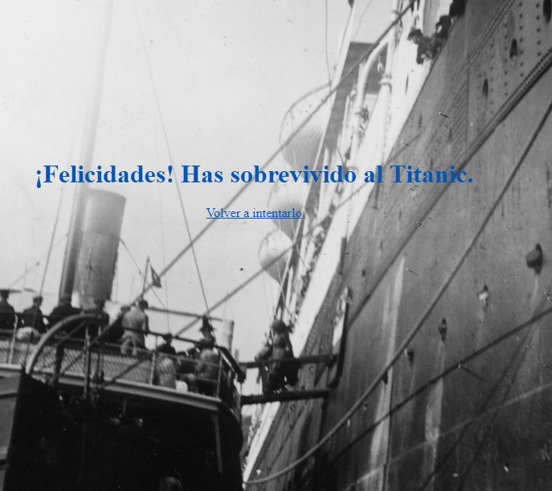
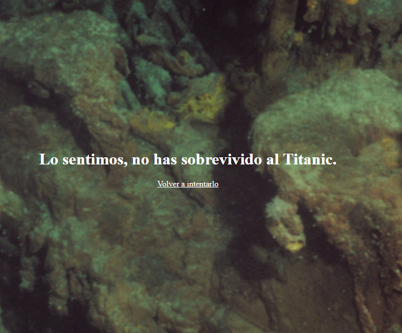

# Proyecto Titanic: Modelo de Supervivencia

## Introducción 🚢

Este proyecto tiene como objetivo predecir la supervivencia de los pasajeros del Titanic basándose en diferentes características como el lugar de embarque, sexo, edad, y clase social. Utilizamos un modelo de aprendizaje supervisado para realizar estas predicciones y una aplicación web desarrollada con Flask para interactuar con el modelo.

## Tecnologías Utilizadas 🛠️

- **Python**: Lenguaje de programación principal utilizado para el desarrollo del modelo y la lógica de la aplicación.
- **Pandas**: Librería utilizada para la manipulación y análisis de datos.
- **Scikit-Learn**: Biblioteca utilizada para construir y evaluar el modelo de aprendizaje supervisado.
- **Flask**: Framework de microservicios utilizado para desarrollar la aplicación web.
- **Pickle**: Utilizado para serializar y deserializar el modelo entrenado.
- **Docker**: Herramienta de contenedorización utilizada para empaquetar la aplicación y sus dependencias.
- **HTML/CSS**: Tecnologías utilizadas para desarrollar las plantillas de la aplicación web.
- **Gunicorn**: Servidor WSGI para desplegar la aplicación Flask.

## Modelo de Aprendizaje Supervisado

El modelo se construyó utilizando un conjunto de datos históricos de los pasajeros del Titanic. Se emplearon las siguientes características:

- **Pclass**: Clase del pasajero (1, 2 o 3)
- **Sex**: Sexo del pasajero
- **Age**: Edad del pasajero
- **SibSp**: Número de hermanos/esposos a bordo
- **Parch**: Número de padres/hijos a bordo
- **Embarked**: Puerto de embarque (C = Cherbourg; Q = Queenstown; S = Southampton)

Estas características se preprocesaron, y se transformaron en variables dummy para poder ser utilizadas por el modelo de regresión logística. El modelo se entrenó y evaluó utilizando un conjunto de prueba, alcanzando una precisión considerable.

## Aplicación Web

La aplicación web desarrollada con Flask permite a los usuarios ingresar las características mencionadas y obtener una predicción sobre la supervivencia del pasajero. La interfaz es simple e intuitiva, facilitando la interacción con el modelo.

### Capturas de Pantalla

#### Formulario selección datos

#### Sobrevives

#### No sobrevives

## Dockerización

La aplicación se ha dockerizado para asegurar que se pueda ejecutar de manera consistente en cualquier entorno. El Dockerfile incluye las instrucciones para construir la imagen, instalar las dependencias necesarias y ejecutar la aplicación.

## Conclusiones

Este proyecto demuestra cómo las técnicas de aprendizaje supervisado pueden aplicarse a problemas del mundo real para obtener predicciones útiles. Aunque no podemos cambiar el pasado, podemos aprender de él y aplicar este conocimiento en diversas áreas.

Si el Titanic hubiera tenido acceso a este modelo, ¡quién sabe cuántas vidas podrían haberse salvado (o al menos, no hubieramos esperado 25 años para saber que Jack cabia en la tabla)!

## Licencia 📃

Este proyecto está bajo la Licencia MIT.

---

## Autores

Hecho con ❤️ por:
- [Fernando Maciá](https://github.com/fernandomacia)
- [Carlos Pérez](https://github.com/CarPeAs)

